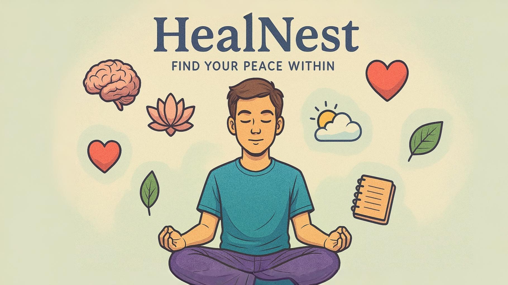

# 🧠 HealNest

An engaging mental wellness platform that combines self-care education with interactive tools like games, quizzes, and affirmations to support emotional growth and mental clarity.


## 🌐 Live Site

Check it out here: [https://healnest.vercel.app](https://healnest.vercel.app)

## 📸 Preview

 <!-- Replace this with actual preview path if needed -->

## 🚀 Features

- 🎮 Fun games and mental exercises  
- 📚 Educational mental health resources  
- 🧘 Affirmations and breathing guides  
- 📝 Mood tracking and reflection tools  
- 📱 Fully responsive and mobile-friendly design

## 🛠️ Built With

- **Frontend**: HTML, CSS, JavaScript  
- **Design**: Custom UI/UX with smooth animations  
- **Hosting**: Vercel

## 🧑‍💻 Installation

To run it locally:

```bash
git clone https://github.com/KetanMane/healnest.git
cd healnest
open index.html
